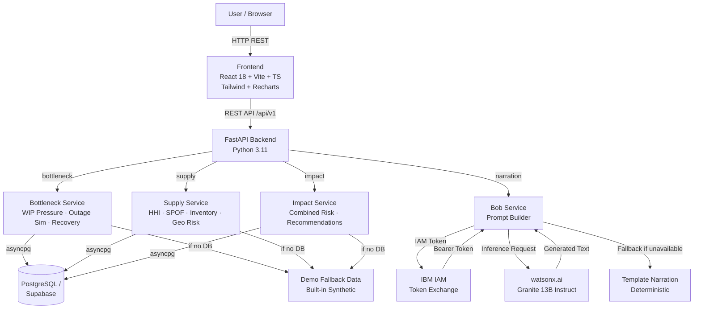

# Architecture

## System Architecture

## Components

| Component | Technology | Responsibility |
|---|---|---|
| Frontend | React 18, Vite, TypeScript, Tailwind CSS, Recharts | Industrial dashboard UI — bottleneck scores, outage simulator, supply risk panels, Bob narration |
| Backend API | FastAPI, Pydantic v2, Python 3.11 | Business logic, orchestration, all deterministic calculations, Bob prompt assembly |
| Bottleneck Service | NumPy, pure Python | WIP pressure, capacity pressure, composite bottleneck score, outage simulation, recovery calculation, downstream impact |
| Supply Chain Service | NumPy, pure Python | HHI calculation, SPOF detection, inventory coverage, geopolitical risk scoring, combined material risk |
| Impact Service | Pure Python | Combined manufacturing + supply risk, rule-based mitigation recommendations |
| Bob Narration Service | httpx (async) | IBM watsonx.ai Granite 13B call, IAM token exchange, deterministic fallback templates |
| Database | PostgreSQL / Supabase | Tool data, utilisation snapshots, WIP lots, materials, suppliers, inventory, simulations |
| Demo Mode | In-memory Python dicts | Full synthetic data so the app runs without a DB or Bob credentials |

## Data Flow

1. Frontend loads → calls `GET /api/v1/bottleneck/` → backend computes bottleneck scores for all tools from DB (or demo fallback)
2. User selects `LITH-07` → frontend calls `GET /api/v1/impact/LITH-07` → combined risk assessment fetched
3. User sets outage hours to 8 and clicks RUN → frontend calls `GET /api/v1/impact/LITH-07?outage_hours=8` → outage simulation included in combined result
4. Combined result rendered in all panels; Bob panel auto-calls `POST /api/v1/narration/` with structured JSON context
5. Bob service exchanges IBM Cloud API key for IAM token, calls watsonx.ai, returns natural-language brief
6. If Bob is unavailable → fallback template narration returned; `is_fallback: true` flagged in response

## Security Considerations

- All credentials (BOB_API_KEY, DATABASE_URL) stored in environment variables, never committed
- `.env.example` committed; `.env` in `.gitignore`
- CORS configured via `ALLOWED_ORIGINS` env var (default: localhost:5173 only)
- No authentication layer in prototype scope — production deployment would require Bearer token auth

## Scalability Notes

- FastAPI backend is stateless; horizontally scalable behind a load balancer
- asyncpg connection pool (2–10 connections) handles concurrent requests
- Bob narration calls are the I/O bottleneck; caching by `prompt_hash` in `bob_narrations` table would reduce repeat API calls
- Demo fallback data is read-only in-process — no external dependency, sub-millisecond response
